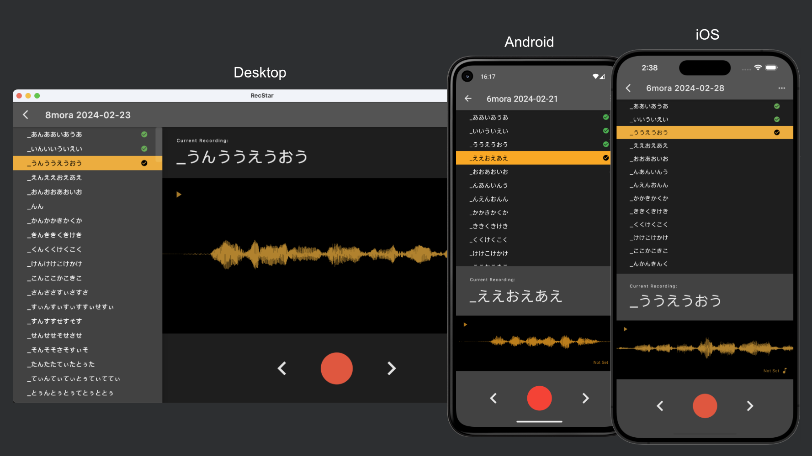

# RecStar

A UTAU style reclist recorder application for Desktop/iOS/Android.

## Features

- Manage recording sessions with individual settings (reclist, guide BGM, etc.)
- Manage reclists with corresponding comment files
- Continuous recording with a guide BGM
- Automation actions (e.g. auto listen back after recording)
- Configurable sample rate and bit depth
- (only on Desktop) Selectable audio input/output devices
- Auto encoding detection when loading text files
- Adaptive UI layout for landscape and portrait modes
- Light and dark themes
- Multi-language support (English, Japanese, Chinese)

## Download

See the [releases page](https://github.com/sdercolin/recstar/releases) for the latest version.

### Desktop

- Windows: `~win64.zip`
- macOS (Intel): `~mac-x64.dmg`
- macOS (Apple Silicon): `~mac-arm64.dmg`
- Ubuntu: `~amd64.deb`

For other types of Linux os, please try building it by yourself.

### Android

#### APK

Attached in the release page.

#### Play Store

Get the latest version via Play Store with the following public test link:
https://play.google.com/store/apps/details?id=com.sdercolin.recstar

### iOS

Get the latest version via TestFlight with the following link:
https://testflight.apple.com/join/jBfhclHr

## Getting started

1. Prepare UTAU reclists that fit your needs. The reclists used in the screenshots are
   from [巽式連続音録音リスト](https://tatsu3.hateblo.jp/entry/ar426004).
2. Click the "+" button to create a new session.
3. Click the "..." button to import a reclist.
4. Click the imported item, and the session will be created.
5. (Optional) If you want to use a guide BGM, click the music note button to import and select a BGM file. An
   OREMO-style BGM config file can be imported as well for continuous recording and trimming.
   Note: On Desktop, the config file should be in the same directory as the BGM file, and named
   as `<same_name_with_the_guide_bgm_file>.txt`, to be automatically detected.
6. Click the "Record" button to start recording.
7. Click the audio graph to listen back to the recorded files.
8. After recording, click the "..." button and select "Export" or "Open Directory" to access the recorded files.

## Feedback

If you have any feedback, please join our [Discord Server](https://discord.gg/TyEcQ6P73y) and find the #recstar channel,
or open an issue in this repository.

Please provide the info from "Settings" -> "About" -> "Copy Device Info" and relevant screenshots when reporting issues.

If you are using the desktop version, please also provide the log files located in the `logs` directory under the app
directory (you can open it with window menu "Help" -> "Open App Directory" in the app).

## Getting started with development

RecStar is built with [Compose Multiplatform](https://github.com/JetBrains/compose-jb).

See the [README of the project template](README-compose.md) for instructions on how to get started.

Other recommended settings

1. Install the `Kotlin KDoc Formatter` plugin, and use the following settings:
   
2. Run `./gradlew addKtlintFormatGitPreCommitHook` once to add a pre-commit hook that will automatically format your
   code before committing.
3. If in string definition files (e.g. [StringsEnglish.kt](shared/src/commonMain/kotlin/ui/string/StringEnglish.kt)), if
   the formatter of your Android Studio is always turning the wildcard imports into single imports, adjust the settings
   to allow wildcard imports on package `ui.string`.

### Contributors

Logo designed by InochiPM.
